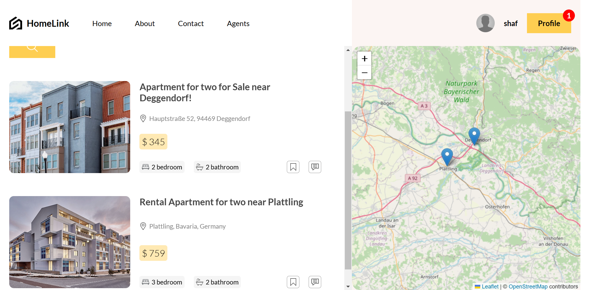
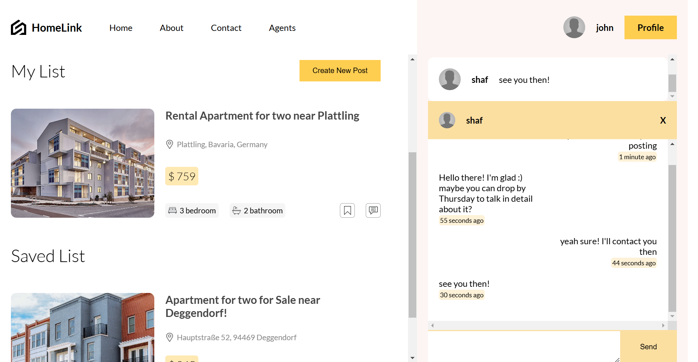

# Project HomeLink

Welcome to Project HomeLink! HomeLink allows users to browse apartments, create listings, and interact with other users. Postings are displayed on a world map, providing an intuitive interface to explore available properties. Users can save posts and contact other individuals through the platform.

### Main Homepage


### Listings Page


### Saved Posts and Contact


## Prerequisites 
Node.js and npm

## Installation
Clone the repository:
```bash
git clone https://github.com/shafwanur/project-homelink
```

Navigate into the `api`, `client`, and `socket` directories and run `npm install` in each:

```bash
cd api
npm install
cd ../client
npm install
cd ../socket
npm install
```

After installing the dependencies, start the backend and frontend:

In the api directory, run:
```bash
cd api
node app.js
```
```bash
cd socket
node app.js
```
```bash
cd client
npm run dev
```

The project should now be running at http://localhost:5173.

## Project Structure
```
my-repo/
├── .env
├── .gitignore
├── dir_to_json.py
├── main.py
├── package-lock.json
├── api/
│   ├── .env
│   ├── .gitignore
│   ├── app.js
│   ├── package-lock.json
│   ├── package.json
│   ├── controllers/
│   ├── lib/
│   ├── middleware/
│   ├── prisma/
│   └── routes/
├── client/
│   ├── .env
│   ├── .eslintrc.cjs
│   ├── .gitignore
│   ├── index.html
│   ├── package-lock.json
│   ├── package.json
│   ├── README.md
│   ├── vite.config.js
│   ├── public/
│   └── src/
├── socket/
│   ├── .gitignore
│   ├── app.js
│   ├── package-lock.json
│   └── package.json
```

